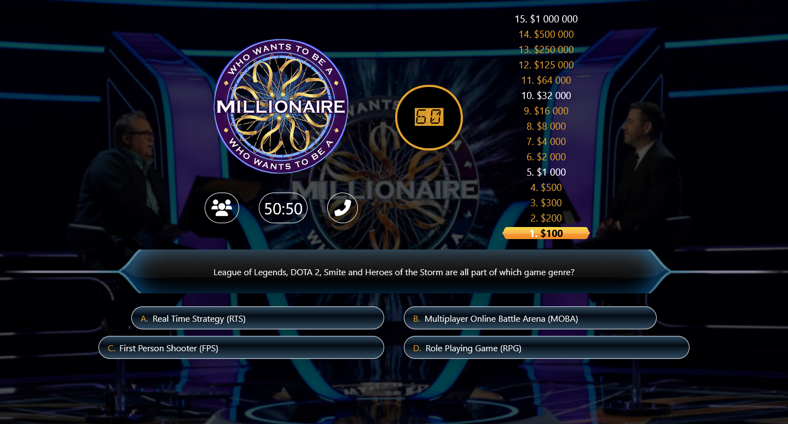
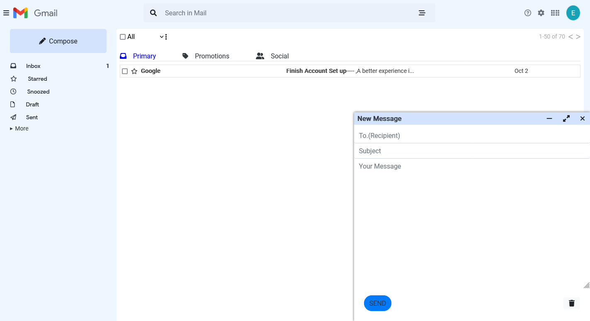
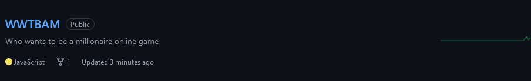
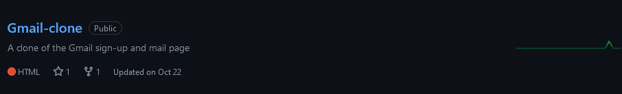

  <h1 align="center"><b>Hi there, I'm Emmanuel</h1>

&nbsp;

 

An enthusiastic Frontend developer who enjoys thinking creatively solving Problems.

<h3 align="center"> 💼 Languages and Tools</h3>

 

 

 

<h2 align="center">My current favorite projects 💻</h2>
 
 

  
  
  
  

 

